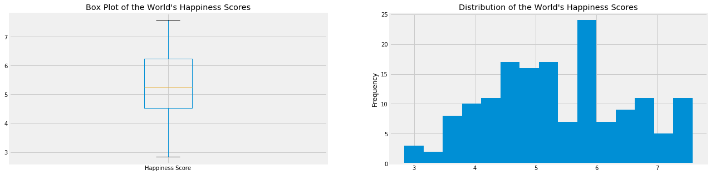
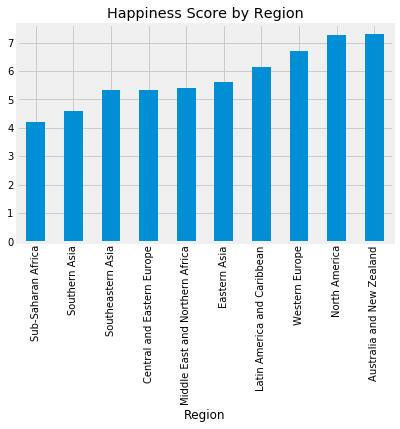
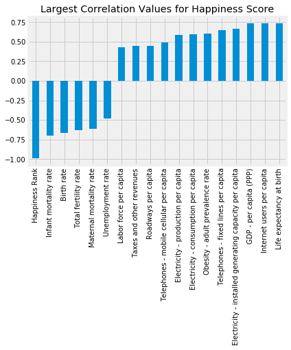
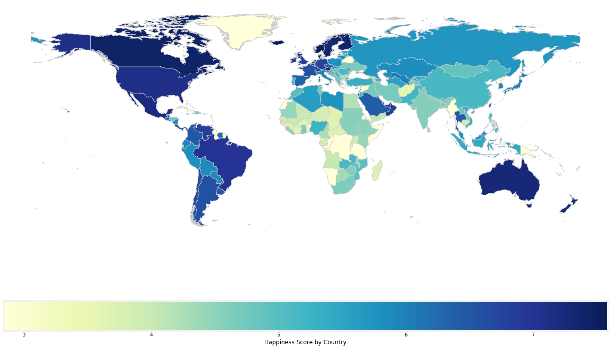
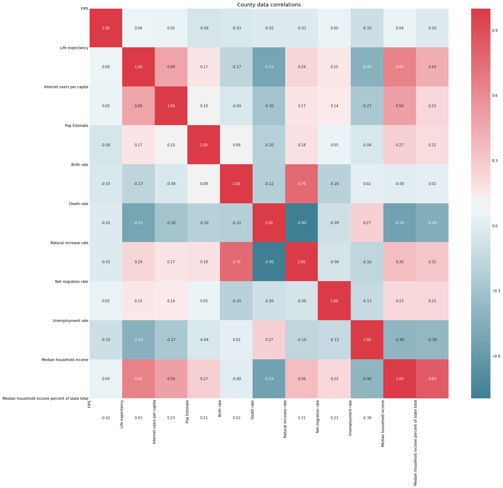
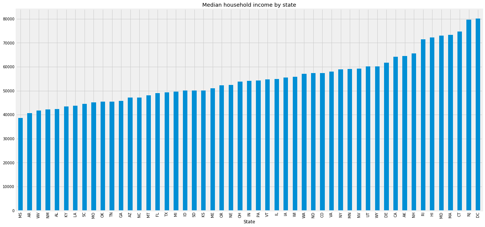
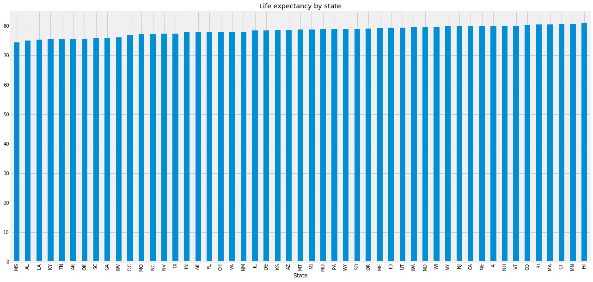
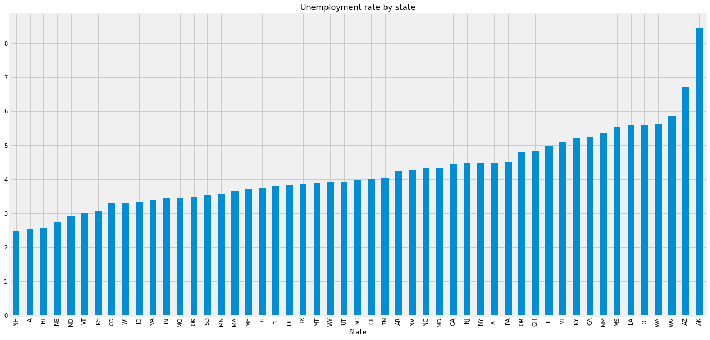
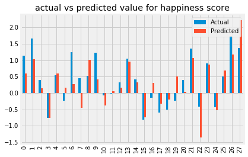
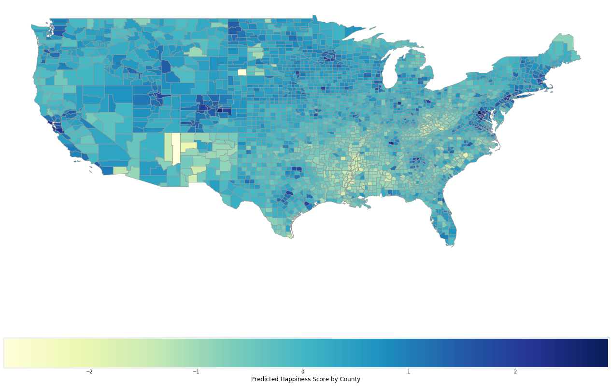

# Final Tutorial: The Happiness Project

## Intro
This project is a collaboration between Eli Mendels and Matt Catralano for our Data Science class with Nick Mattei. We will be examining what metrics correspond to national happiness and then trying to predict which counties in the US will be the happiest.

## Housekeeping Stuff


```python
#Importing all the necesary libraries. 
import sqlite3
import pandas as pd

import geopandas as geo
import numpy as np
import matplotlib
import matplotlib.pyplot as plt
from scipy import stats
import re
import seaborn as sns
import sklearn
from sklearn import linear_model
import random
import shapefile

#The below is for formatting and taken from past labs written by Nick Mattei
#This lets us show plots inline and also save PDF plots if we want them
%matplotlib inline
from matplotlib.backends.backend_pdf import PdfPages
matplotlib.style.use('fivethirtyeight')

# These two things are for Pandas, it widens the notebook and lets us display data easily.
from IPython.core.display import display, HTML
display(HTML("<style>.container { width:95% !important; }</style>"))

#Show all the rows of a dataframe
pd.options.display.max_rows = 10000
pd.options.display.width = 1000
```


<style>.container { width:95% !important; }</style>


## Examining the Country Data
In looking at the country data, the first step is to read it into a dataframe. Once the data has been read, we will clean it to prepare it for analysis and add any other data that we deem important.

### Reading in the Data

#### World Factbook Data

Most of our country data will come from the CIA world factbook. We got the data in csv format from https://github.com/thewiremonkey/factbook.csv. 
The data is formatted in a collection of spreadsheets, each of which contains three columns: a rank, the name, and the value. Each spreadsheet contains one measurement, for example population, so they must be iterated over and then each spreadsheet must be joined on name to the cumulative table.

Information about the dataset is found in the categories csv which gives a code and names the measurement for each spreadsheet. This is what will be iterated over to generate the factbook dataframe.


```python
#Reading in a summary of the csv files
categories_df = pd.read_csv('categories.csv')
categories_df.head()
```


<div>
<style scoped>
    .dataframe tbody tr th:only-of-type {
        vertical-align: middle;
    }

    .dataframe tbody tr th {
        vertical-align: top;
    }

    .dataframe thead th {
        text-align: right;
    }
</style>
<table border="1" class="dataframe">
  <thead>
    <tr style="text-align: right;">
      <th></th>
      <th>Num</th>
      <th>Category</th>
      <th>Name</th>
    </tr>
  </thead>
  <tbody>
    <tr>
      <th>0</th>
      <td>2147</td>
      <td>Geography</td>
      <td>Area</td>
    </tr>
    <tr>
      <th>1</th>
      <td>2119</td>
      <td>People and Society</td>
      <td>Population</td>
    </tr>
    <tr>
      <th>2</th>
      <td>2002</td>
      <td>People and Society</td>
      <td>Population growth rate</td>
    </tr>
    <tr>
      <th>3</th>
      <td>2054</td>
      <td>People and Society</td>
      <td>Birth rate</td>
    </tr>
    <tr>
      <th>4</th>
      <td>2066</td>
      <td>People and Society</td>
      <td>Death rate</td>
    </tr>
  </tbody>
</table>
</div>


```python
#A string to store part of the file names
csv_string = 'WorldFactBookData/c'
#Temporary dataframe to store csvs that need to be added to the dataframe. 
#It's used here to ge the names of each country
df_to_add = pd.read_csv('WorldFactBookData/c2147.csv')
#Creating the dataframe with just the names
factbook_df = pd.DataFrame({'Name' : df_to_add['Name']})

```


```python
#Iterating through each file code in the categories list and adding the csv to the dataframe
for index, row in categories_df.iterrows():
    file_name = csv_string  + str(row['Num']) + '.csv'
    df_to_add = pd.read_csv(file_name)
    df_to_add = df_to_add.drop(columns=['Pos'])
    column_name = row['Name']
    df_to_add = df_to_add.rename(columns={"Value": column_name})
    factbook_df = factbook_df.merge(df_to_add, how = 'left')
```


```python
factbook_df.head()
```


<div>
<style scoped>
    .dataframe tbody tr th:only-of-type {
        vertical-align: middle;
    }

    .dataframe tbody tr th {
        vertical-align: top;
    }

    .dataframe thead th {
        text-align: right;
    }
</style>
<table border="1" class="dataframe">
  <thead>
    <tr style="text-align: right;">
      <th></th>
      <th>Name</th>
      <th>Area</th>
      <th>Population</th>
      <th>Population growth rate</th>
      <th>Birth rate</th>
      <th>Death rate</th>
      <th>Net migration rate</th>
      <th>Maternal mortality rate</th>
      <th>Infant mortality rate</th>
      <th>Life expectancy at birth</th>
      <th>...</th>
      <th>Natural gas - imports</th>
      <th>Natural gas - proved reserves</th>
      <th>Telephones - fixed lines</th>
      <th>Telephones - mobile cellular</th>
      <th>Internet users</th>
      <th>Airports</th>
      <th>Railways</th>
      <th>Roadways</th>
      <th>Waterways</th>
      <th>Military expenditures</th>
    </tr>
  </thead>
  <tbody>
    <tr>
      <th>0</th>
      <td>Russia</td>
      <td>17098242</td>
      <td>1.424238e+08</td>
      <td>-0.04</td>
      <td>11.60</td>
      <td>13.69</td>
      <td>1.69</td>
      <td>34.0</td>
      <td>6.97</td>
      <td>70.47</td>
      <td>...</td>
      <td>8.200000e+09</td>
      <td>4.780000e+13</td>
      <td>39430000.0</td>
      <td>2.210000e+08</td>
      <td>84400000.0</td>
      <td>1218.0</td>
      <td>87157.0</td>
      <td>1283387.0</td>
      <td>102000.0</td>
      <td>3.49</td>
    </tr>
    <tr>
      <th>1</th>
      <td>Canada</td>
      <td>9984670</td>
      <td>3.509984e+07</td>
      <td>0.75</td>
      <td>10.28</td>
      <td>8.42</td>
      <td>5.66</td>
      <td>12.0</td>
      <td>4.65</td>
      <td>81.76</td>
      <td>...</td>
      <td>2.670000e+10</td>
      <td>1.889000e+12</td>
      <td>16600000.0</td>
      <td>2.950000e+07</td>
      <td>32400000.0</td>
      <td>1467.0</td>
      <td>46552.0</td>
      <td>1042300.0</td>
      <td>636.0</td>
      <td>1.24</td>
    </tr>
    <tr>
      <th>2</th>
      <td>United States</td>
      <td>9826675</td>
      <td>3.213689e+08</td>
      <td>0.78</td>
      <td>12.49</td>
      <td>8.15</td>
      <td>3.86</td>
      <td>21.0</td>
      <td>5.87</td>
      <td>79.68</td>
      <td>...</td>
      <td>8.163000e+10</td>
      <td>8.734000e+12</td>
      <td>129400000.0</td>
      <td>3.174000e+08</td>
      <td>276600000.0</td>
      <td>13513.0</td>
      <td>224792.0</td>
      <td>6586610.0</td>
      <td>41009.0</td>
      <td>4.35</td>
    </tr>
    <tr>
      <th>3</th>
      <td>China</td>
      <td>9596960</td>
      <td>1.367485e+09</td>
      <td>0.45</td>
      <td>12.49</td>
      <td>7.53</td>
      <td>-0.44</td>
      <td>37.0</td>
      <td>12.44</td>
      <td>75.41</td>
      <td>...</td>
      <td>5.190000e+10</td>
      <td>3.300000e+12</td>
      <td>249400000.0</td>
      <td>1.300000e+09</td>
      <td>626600000.0</td>
      <td>507.0</td>
      <td>86000.0</td>
      <td>4106387.0</td>
      <td>110000.0</td>
      <td>1.99</td>
    </tr>
    <tr>
      <th>4</th>
      <td>Brazil</td>
      <td>8514877</td>
      <td>2.042598e+08</td>
      <td>0.77</td>
      <td>14.46</td>
      <td>6.58</td>
      <td>-0.14</td>
      <td>56.0</td>
      <td>18.60</td>
      <td>73.53</td>
      <td>...</td>
      <td>1.385000e+10</td>
      <td>3.887000e+11</td>
      <td>44100000.0</td>
      <td>2.807000e+08</td>
      <td>108200000.0</td>
      <td>4093.0</td>
      <td>28538.0</td>
      <td>1580964.0</td>
      <td>50000.0</td>
      <td>1.47</td>
    </tr>
  </tbody>
</table>
<p>5 rows × 74 columns</p>
</div>


### Happiness Data

Now that we have a dataframe that stores our data about each country, it's time to look at the results of the happiness survey for each country. This process is fairly easy because it is already in one csv file ready to go.


```python
happiness_df = pd.read_csv('2015.csv')
```


```python
happiness_df.head()
```


<div>
<style scoped>
    .dataframe tbody tr th:only-of-type {
        vertical-align: middle;
    }

    .dataframe tbody tr th {
        vertical-align: top;
    }

    .dataframe thead th {
        text-align: right;
    }
</style>
<table border="1" class="dataframe">
  <thead>
    <tr style="text-align: right;">
      <th></th>
      <th>Country</th>
      <th>Region</th>
      <th>Happiness Rank</th>
      <th>Happiness Score</th>
      <th>Standard Error</th>
      <th>Economy (GDP per Capita)</th>
      <th>Family</th>
      <th>Health (Life Expectancy)</th>
      <th>Freedom</th>
      <th>Trust (Government Corruption)</th>
      <th>Generosity</th>
      <th>Dystopia Residual</th>
    </tr>
  </thead>
  <tbody>
    <tr>
      <th>0</th>
      <td>Switzerland</td>
      <td>Western Europe</td>
      <td>1</td>
      <td>7.587</td>
      <td>0.03411</td>
      <td>1.39651</td>
      <td>1.34951</td>
      <td>0.94143</td>
      <td>0.66557</td>
      <td>0.41978</td>
      <td>0.29678</td>
      <td>2.51738</td>
    </tr>
    <tr>
      <th>1</th>
      <td>Iceland</td>
      <td>Western Europe</td>
      <td>2</td>
      <td>7.561</td>
      <td>0.04884</td>
      <td>1.30232</td>
      <td>1.40223</td>
      <td>0.94784</td>
      <td>0.62877</td>
      <td>0.14145</td>
      <td>0.43630</td>
      <td>2.70201</td>
    </tr>
    <tr>
      <th>2</th>
      <td>Denmark</td>
      <td>Western Europe</td>
      <td>3</td>
      <td>7.527</td>
      <td>0.03328</td>
      <td>1.32548</td>
      <td>1.36058</td>
      <td>0.87464</td>
      <td>0.64938</td>
      <td>0.48357</td>
      <td>0.34139</td>
      <td>2.49204</td>
    </tr>
    <tr>
      <th>3</th>
      <td>Norway</td>
      <td>Western Europe</td>
      <td>4</td>
      <td>7.522</td>
      <td>0.03880</td>
      <td>1.45900</td>
      <td>1.33095</td>
      <td>0.88521</td>
      <td>0.66973</td>
      <td>0.36503</td>
      <td>0.34699</td>
      <td>2.46531</td>
    </tr>
    <tr>
      <th>4</th>
      <td>Canada</td>
      <td>North America</td>
      <td>5</td>
      <td>7.427</td>
      <td>0.03553</td>
      <td>1.32629</td>
      <td>1.32261</td>
      <td>0.90563</td>
      <td>0.63297</td>
      <td>0.32957</td>
      <td>0.45811</td>
      <td>2.45176</td>
    </tr>
  </tbody>
</table>
</div>


## Combining the Country Data

The next step is to combine the two data sets with country data. This will be done with a simple left join on the happiness dataframe because we are only interested in the countries that have a happiness score. 

The first thing we will do is find out which countries are in the happiness survey but not the world factbook. Once that is done, decisions will be made on a case by case basis to determine whether the data needs to be manipulated for the join to work or if those specific rows need to be dropped. Since some countries go by different names in the two different datasets, it is likely that some names will need to be changed in one data set so that the primary keys match up.


```python
#An initial merge to find which countries names need to be manually changed for the match. 
#Since there are only 8 countries they will be addressed manually
prelim_merge = happiness_df.merge(factbook_df, how = 'left', left_on = 'Country', right_on = 'Name')
countries_to_match = prelim_merge[prelim_merge['Area'].isnull()]
countries_to_match
```


<div>
<style scoped>
    .dataframe tbody tr th:only-of-type {
        vertical-align: middle;
    }

    .dataframe tbody tr th {
        vertical-align: top;
    }

    .dataframe thead th {
        text-align: right;
    }
</style>
<table border="1" class="dataframe">
  <thead>
    <tr style="text-align: right;">
      <th></th>
      <th>Country</th>
      <th>Region</th>
      <th>Happiness Rank</th>
      <th>Happiness Score</th>
      <th>Standard Error</th>
      <th>Economy (GDP per Capita)</th>
      <th>Family</th>
      <th>Health (Life Expectancy)</th>
      <th>Freedom</th>
      <th>Trust (Government Corruption)</th>
      <th>...</th>
      <th>Natural gas - imports</th>
      <th>Natural gas - proved reserves</th>
      <th>Telephones - fixed lines</th>
      <th>Telephones - mobile cellular</th>
      <th>Internet users</th>
      <th>Airports</th>
      <th>Railways</th>
      <th>Roadways</th>
      <th>Waterways</th>
      <th>Military expenditures</th>
    </tr>
  </thead>
  <tbody>
    <tr>
      <th>46</th>
      <td>South Korea</td>
      <td>Eastern Asia</td>
      <td>47</td>
      <td>5.984</td>
      <td>0.04098</td>
      <td>1.24461</td>
      <td>0.95774</td>
      <td>0.96538</td>
      <td>0.33208</td>
      <td>0.07857</td>
      <td>...</td>
      <td>NaN</td>
      <td>NaN</td>
      <td>NaN</td>
      <td>NaN</td>
      <td>NaN</td>
      <td>NaN</td>
      <td>NaN</td>
      <td>NaN</td>
      <td>NaN</td>
      <td>NaN</td>
    </tr>
    <tr>
      <th>65</th>
      <td>North Cyprus</td>
      <td>Western Europe</td>
      <td>66</td>
      <td>5.695</td>
      <td>0.05635</td>
      <td>1.20806</td>
      <td>1.07008</td>
      <td>0.92356</td>
      <td>0.49027</td>
      <td>0.14280</td>
      <td>...</td>
      <td>NaN</td>
      <td>NaN</td>
      <td>NaN</td>
      <td>NaN</td>
      <td>NaN</td>
      <td>NaN</td>
      <td>NaN</td>
      <td>NaN</td>
      <td>NaN</td>
      <td>NaN</td>
    </tr>
    <tr>
      <th>90</th>
      <td>Somaliland region</td>
      <td>Sub-Saharan Africa</td>
      <td>91</td>
      <td>5.057</td>
      <td>0.06161</td>
      <td>0.18847</td>
      <td>0.95152</td>
      <td>0.43873</td>
      <td>0.46582</td>
      <td>0.39928</td>
      <td>...</td>
      <td>NaN</td>
      <td>NaN</td>
      <td>NaN</td>
      <td>NaN</td>
      <td>NaN</td>
      <td>NaN</td>
      <td>NaN</td>
      <td>NaN</td>
      <td>NaN</td>
      <td>NaN</td>
    </tr>
    <tr>
      <th>107</th>
      <td>Palestinian Territories</td>
      <td>Middle East and Northern Africa</td>
      <td>108</td>
      <td>4.715</td>
      <td>0.04394</td>
      <td>0.59867</td>
      <td>0.92558</td>
      <td>0.66015</td>
      <td>0.24499</td>
      <td>0.12905</td>
      <td>...</td>
      <td>NaN</td>
      <td>NaN</td>
      <td>NaN</td>
      <td>NaN</td>
      <td>NaN</td>
      <td>NaN</td>
      <td>NaN</td>
      <td>NaN</td>
      <td>NaN</td>
      <td>NaN</td>
    </tr>
    <tr>
      <th>119</th>
      <td>Congo (Kinshasa)</td>
      <td>Sub-Saharan Africa</td>
      <td>120</td>
      <td>4.517</td>
      <td>0.03680</td>
      <td>0.00000</td>
      <td>1.00120</td>
      <td>0.09806</td>
      <td>0.22605</td>
      <td>0.07625</td>
      <td>...</td>
      <td>NaN</td>
      <td>NaN</td>
      <td>NaN</td>
      <td>NaN</td>
      <td>NaN</td>
      <td>NaN</td>
      <td>NaN</td>
      <td>NaN</td>
      <td>NaN</td>
      <td>NaN</td>
    </tr>
    <tr>
      <th>128</th>
      <td>Myanmar</td>
      <td>Southeastern Asia</td>
      <td>129</td>
      <td>4.307</td>
      <td>0.04351</td>
      <td>0.27108</td>
      <td>0.70905</td>
      <td>0.48246</td>
      <td>0.44017</td>
      <td>0.19034</td>
      <td>...</td>
      <td>NaN</td>
      <td>NaN</td>
      <td>NaN</td>
      <td>NaN</td>
      <td>NaN</td>
      <td>NaN</td>
      <td>NaN</td>
      <td>NaN</td>
      <td>NaN</td>
      <td>NaN</td>
    </tr>
    <tr>
      <th>138</th>
      <td>Congo (Brazzaville)</td>
      <td>Sub-Saharan Africa</td>
      <td>139</td>
      <td>3.989</td>
      <td>0.06682</td>
      <td>0.67866</td>
      <td>0.66290</td>
      <td>0.31051</td>
      <td>0.41466</td>
      <td>0.11686</td>
      <td>...</td>
      <td>NaN</td>
      <td>NaN</td>
      <td>NaN</td>
      <td>NaN</td>
      <td>NaN</td>
      <td>NaN</td>
      <td>NaN</td>
      <td>NaN</td>
      <td>NaN</td>
      <td>NaN</td>
    </tr>
    <tr>
      <th>150</th>
      <td>Ivory Coast</td>
      <td>Sub-Saharan Africa</td>
      <td>151</td>
      <td>3.655</td>
      <td>0.05141</td>
      <td>0.46534</td>
      <td>0.77115</td>
      <td>0.15185</td>
      <td>0.46866</td>
      <td>0.17922</td>
      <td>...</td>
      <td>NaN</td>
      <td>NaN</td>
      <td>NaN</td>
      <td>NaN</td>
      <td>NaN</td>
      <td>NaN</td>
      <td>NaN</td>
      <td>NaN</td>
      <td>NaN</td>
      <td>NaN</td>
    </tr>
  </tbody>
</table>
<p>8 rows × 86 columns</p>
</div>


The countries that are recognized in both dataframes are renamed below and the countries not universally recognized will be dropped. This is the first major decision we will make with regards to missing data. In the end, we decided to not look at North Cyprus, Somaliland, or Palestine as these regions are contested and not widely recognized.


```python
#Renaming Korea, South to South Korea in the factbook_df
factbook_df.at[108, 'Name'] = 'South Korea'
#Renaming Burma to Myanmar in the factbook_df
factbook_df.at[39, 'Name'] = 'Myanmar'
#Renaming Cote d'Ivoire to Ivory Coast in the factbook_df
factbook_df.at[68, 'Name'] = 'Ivory Coast'
#Renaming Congo, Republic of the to Congo (Brazzaville) in the factbook_df
factbook_df.at[63, 'Name'] = 'Congo (Brazzaville)'
#Renaming Congo, Democratic Republic of the to Congo (Kinshasa) in the factbook_df
factbook_df.at[10, 'Name'] = 'Congo (Kinshasa)'
```


```python
#Creating a final dataframe to store all of our country data
countries_df = happiness_df.merge(factbook_df, how = 'left', left_on = 'Country', right_on = 'Name')
```


```python
countries_df.head()
```


<div>
<style scoped>
    .dataframe tbody tr th:only-of-type {
        vertical-align: middle;
    }

    .dataframe tbody tr th {
        vertical-align: top;
    }

    .dataframe thead th {
        text-align: right;
    }
</style>
<table border="1" class="dataframe">
  <thead>
    <tr style="text-align: right;">
      <th></th>
      <th>Country</th>
      <th>Region</th>
      <th>Happiness Rank</th>
      <th>Happiness Score</th>
      <th>Standard Error</th>
      <th>Economy (GDP per Capita)</th>
      <th>Family</th>
      <th>Health (Life Expectancy)</th>
      <th>Freedom</th>
      <th>Trust (Government Corruption)</th>
      <th>...</th>
      <th>Natural gas - imports</th>
      <th>Natural gas - proved reserves</th>
      <th>Telephones - fixed lines</th>
      <th>Telephones - mobile cellular</th>
      <th>Internet users</th>
      <th>Airports</th>
      <th>Railways</th>
      <th>Roadways</th>
      <th>Waterways</th>
      <th>Military expenditures</th>
    </tr>
  </thead>
  <tbody>
    <tr>
      <th>0</th>
      <td>Switzerland</td>
      <td>Western Europe</td>
      <td>1</td>
      <td>7.587</td>
      <td>0.03411</td>
      <td>1.39651</td>
      <td>1.34951</td>
      <td>0.94143</td>
      <td>0.66557</td>
      <td>0.41978</td>
      <td>...</td>
      <td>3.764000e+09</td>
      <td>0.000000e+00</td>
      <td>4370000.0</td>
      <td>11500000.0</td>
      <td>7100000.0</td>
      <td>63.0</td>
      <td>4876.0</td>
      <td>71464.0</td>
      <td>1292.0</td>
      <td>0.76</td>
    </tr>
    <tr>
      <th>1</th>
      <td>Iceland</td>
      <td>Western Europe</td>
      <td>2</td>
      <td>7.561</td>
      <td>0.04884</td>
      <td>1.30232</td>
      <td>1.40223</td>
      <td>0.94784</td>
      <td>0.62877</td>
      <td>0.14145</td>
      <td>...</td>
      <td>0.000000e+00</td>
      <td>0.000000e+00</td>
      <td>170000.0</td>
      <td>370000.0</td>
      <td>316400.0</td>
      <td>96.0</td>
      <td>NaN</td>
      <td>12890.0</td>
      <td>NaN</td>
      <td>0.13</td>
    </tr>
    <tr>
      <th>2</th>
      <td>Denmark</td>
      <td>Western Europe</td>
      <td>3</td>
      <td>7.527</td>
      <td>0.03328</td>
      <td>1.32548</td>
      <td>1.36058</td>
      <td>0.87464</td>
      <td>0.64938</td>
      <td>0.48357</td>
      <td>...</td>
      <td>1.363000e+09</td>
      <td>4.301000e+10</td>
      <td>1880000.0</td>
      <td>7100000.0</td>
      <td>5400000.0</td>
      <td>80.0</td>
      <td>2667.0</td>
      <td>73929.0</td>
      <td>400.0</td>
      <td>1.41</td>
    </tr>
    <tr>
      <th>3</th>
      <td>Norway</td>
      <td>Western Europe</td>
      <td>4</td>
      <td>7.522</td>
      <td>0.03880</td>
      <td>1.45900</td>
      <td>1.33095</td>
      <td>0.88521</td>
      <td>0.66973</td>
      <td>0.36503</td>
      <td>...</td>
      <td>2.000000e+06</td>
      <td>2.090000e+12</td>
      <td>1160000.0</td>
      <td>5900000.0</td>
      <td>4900000.0</td>
      <td>95.0</td>
      <td>4237.0</td>
      <td>93870.0</td>
      <td>1577.0</td>
      <td>1.40</td>
    </tr>
    <tr>
      <th>4</th>
      <td>Canada</td>
      <td>North America</td>
      <td>5</td>
      <td>7.427</td>
      <td>0.03553</td>
      <td>1.32629</td>
      <td>1.32261</td>
      <td>0.90563</td>
      <td>0.63297</td>
      <td>0.32957</td>
      <td>...</td>
      <td>2.670000e+10</td>
      <td>1.889000e+12</td>
      <td>16600000.0</td>
      <td>29500000.0</td>
      <td>32400000.0</td>
      <td>1467.0</td>
      <td>46552.0</td>
      <td>1042300.0</td>
      <td>636.0</td>
      <td>1.24</td>
    </tr>
  </tbody>
</table>
<p>5 rows × 86 columns</p>
</div>


## Cleaning the Country Data

Now that we have the country dataframe it is time to clean it. This means dropping any unnecessary columns, ensuring each column is of the right type, and performing operations on some columns to make them better suited for manipulation

The first step will be to remove all the columns that we won't be looking at. We will start by removing the columns that came with the happiness data as they were already selected as indicators of happiness and could not exist on a county level. Then, we will remove a variety of other columns that we know won't exist at a county level. Most columns removed here have to do with national finances which won't be relevant when we begin to look at county data.


```python
#Creating a list of columns to be removed
columns_to_be_removed = ['Reserves of foreign exchange and gold', 
                         'Standard Error', 'Dystopia Residual', 'Generosity', 'Trust (Government Corruption)', 'Area', 'Gross national saving', 
                         'Inflation rate (consumer prices)', 'Central bank discount rate', 
                         'Commercial bank prime lending rate', 'Stock of narrow money', 
                         'Stock of broad money', 'Stock of domestic credit', 
                         'Market value of publicly traded shares', 'Current account balance', 
                         'Stock of direct foreign investment - at home', 
                         'Stock of direct foreign investment - abroad','Economy (GDP per Capita)',
                         'Family', 'Health (Life Expectancy)', 'Freedom','Name','Railways', 'Waterways']
countries_df = countries_df.drop(columns_to_be_removed, axis = 1)
```

Once those columns are dropped, we will make sure each column is of the correct dtype. To do this, we will use the pd.DataFrame.dtypes method to look at the dtypes of each column and determine which columns are not correct. We will then convert them to the correct once. In this case, this involves removing dollar signs and commas from numbers then converting to float64s.


```python
#Creating a list of all the columns with a leading dollar sign that need to be converted to int64
object_cols = ['GDP (purchasing power parity)','GDP - per capita (PPP)','Exports', 'Imports', 'Debt - external']
#Iterating through the list, removing any non numereical symbols and then casting as float64
for i in object_cols:
    countries_df[i] = countries_df[i].str.replace(',', "")
    countries_df[i] = countries_df[i].str.replace('$', "")
    
    countries_df[i] = countries_df[i].astype('float64')
```

The next data conversion that needs to be done is converting gross metrics into per capita metrics. This is done by creating a list of all the gross metrics, iterating over them to create a column with the per capita version of the metric, and then removing the redundant gross metric column.


```python
gross_measurements = ['Health expenditures', "HIV/AIDS - people living with HIV/AIDS", "HIV/AIDS - deaths",
                           'Children under the age of 5 years underweight', "Education expenditures",
                           'Telephones - fixed lines', 'Telephones - mobile cellular', "Internet users",
                           'Military expenditures', 'Labor force',  'Public debt', 'Electricity - production', 
                           'Electricity - consumption','Electricity - exports', 'Electricity - imports',
                           'Electricity - installed generating capacity', 'Electricity - from fossil fuels',
                           'Electricity - from nuclear fuels','Electricity - from hydroelectric plants',
                           'Electricity - from other renewable sources',"Airports","Roadways"]
for i in gross_measurements:
    countries_df[i + ' per capita'] = countries_df[i] / countries_df["Population"]
    countries_df = countries_df.drop([i], axis=1)
```

Now that we have a clean dataset we will create a standardized version of it. This will allow us to compare across datasets which will be necessary when we start to look at the county data. It is easy to standardize a data frame of only numerical data so we will extract the string columns, standardize the numerical data frame and then add the string columns back.


```python
#Creating the numerical dataframe
numerical_country_df = countries_df.drop(['Country', 'Region'], axis = 1)
#Standardizing it
standardized_country_df = (numerical_country_df-numerical_country_df.mean())/numerical_country_df.std()
#Adding back the names and countries
standardized_country_df.insert(0, 'Region', countries_df['Region'])
standardized_country_df.insert(0, 'Country', countries_df['Country'])
standardized_country_df.head()
```


<div>
<style scoped>
    .dataframe tbody tr th:only-of-type {
        vertical-align: middle;
    }

    .dataframe tbody tr th {
        vertical-align: top;
    }

    .dataframe thead th {
        text-align: right;
    }
</style>
<table border="1" class="dataframe">
    <tr style="text-align: right;">
      <th></th>
      <th>Country</th>
      <th>Region</th>
      <th>Happiness Rank</th>
      <th>Happiness Score</th>
      <th>Population</th>
      <th>Population growth rate</th>
      <th>Birth rate</th>
      <th>Death rate</th>
      <th>Net migration rate</th>
      <th>Maternal mortality rate</th>
      <th>...</th>
      <th>Electricity - consumption per capita</th>
      <th>Electricity - exports per capita</th>
      <th>Electricity - imports per capita</th>
      <th>Electricity - installed generating capacity per capita</th>
      <th>Electricity - from fossil fuels per capita</th>
      <th>Electricity - from nuclear fuels per capita</th>
      <th>Electricity - from hydroelectric plants per capita</th>
      <th>Electricity - from other renewable sources per capita</th>
      <th>Airports per capita</th>
      <th>Roadways per capita</th>
    </tr>
  </thead>
  <tbody>
    <tr>
      <th>0</th>
      <td>Switzerland</td>
      <td>Western Europe</td>
      <td>-1.715545</td>
      <td>1.931219</td>
      <td>-0.248975</td>
      <td>-0.480673</td>
      <td>-0.950014</td>
      <td>-0.033415</td>
      <td>0.981897</td>
      <td>-0.716505</td>
      <td>...</td>
      <td>0.685943</td>
      <td>3.074328</td>
      <td>2.607369</td>
      <td>1.203085</td>
      <td>-0.464098</td>
      <td>1.819206</td>
      <td>0.077187</td>
      <td>-0.136693</td>
      <td>-0.143093</td>
      <td>0.191097</td>
    </tr>
    <tr>
      <th>1</th>
      <td>Iceland</td>
      <td>Western Europe</td>
      <td>-1.693689</td>
      <td>1.908512</td>
      <td>-0.299928</td>
      <td>0.006389</td>
      <td>-0.611258</td>
      <td>-0.643273</td>
      <td>0.914245</td>
      <td>-0.729843</td>
      <td>...</td>
      <td>8.611211</td>
      <td>-0.376462</td>
      <td>-0.366677</td>
      <td>5.755774</td>
      <td>-0.012094</td>
      <td>-0.239281</td>
      <td>8.701226</td>
      <td>10.972255</td>
      <td>10.147123</td>
      <td>3.545234</td>
    </tr>
    <tr>
      <th>2</th>
      <td>Denmark</td>
      <td>Western Europe</td>
      <td>-1.671833</td>
      <td>1.878818</td>
      <td>-0.265591</td>
      <td>-0.957994</td>
      <td>-0.972863</td>
      <td>0.665450</td>
      <td>0.427582</td>
      <td>-0.698721</td>
      <td>...</td>
      <td>0.423006</td>
      <td>1.262585</td>
      <td>1.321365</td>
      <td>1.164753</td>
      <td>-0.099115</td>
      <td>-0.239281</td>
      <td>-0.316728</td>
      <td>0.823799</td>
      <td>0.097323</td>
      <td>0.687626</td>
    </tr>
    <tr>
      <th>3</th>
      <td>Norway</td>
      <td>Western Europe</td>
      <td>-1.649978</td>
      <td>1.874451</td>
      <td>-0.268036</td>
      <td>-0.071541</td>
      <td>-0.787093</td>
      <td>-0.036711</td>
      <td>1.529666</td>
      <td>-0.720951</td>
      <td>...</td>
      <td>3.312754</td>
      <td>2.185816</td>
      <td>1.245195</td>
      <td>4.169140</td>
      <td>-0.446483</td>
      <td>-0.239281</td>
      <td>0.441337</td>
      <td>-0.137957</td>
      <td>0.240239</td>
      <td>1.221403</td>
    </tr>
    <tr>
      <th>4</th>
      <td>Canada</td>
      <td>North America</td>
      <td>-1.628122</td>
      <td>1.791483</td>
      <td>-0.072514</td>
      <td>-0.441708</td>
      <td>-0.971870</td>
      <td>0.062185</td>
      <td>1.182673</td>
      <td>-0.698721</td>
      <td>...</td>
      <td>2.255442</td>
      <td>1.188621</td>
      <td>-0.116518</td>
      <td>2.413041</td>
      <td>-0.446194</td>
      <td>0.002870</td>
      <td>-0.252135</td>
      <td>-0.177538</td>
      <td>1.101298</td>
      <td>2.524606</td>
    </tr>
  </tbody>
</table>
<p>5 rows × 62 columns</p>
</div>


# Exploratory Analysis of the Country Data

With the cleaned and organized data we can finally start to look at what it says. This will be done in a couple ways. The first will be to look at the distribution of happiness. Then we will begin to look at what variables correlate to happiness.

To look at the distribution of happiness, we will use both a box plot and a histogram.


```python
fig, ax = plt.subplots(1, 2, figsize=(20,5))
fig1 = countries_df['Happiness Score'].plot.box(ax = ax[0], title="Box Plot of the World's Happiness Scores")
fig2 = countries_df['Happiness Score'].plot.hist(bins = 15, ax = ax[1], title="Distribution of the World's Happiness Scores")
```





From these graphs, it's clear that the happiness scores follow a somewhat normal distribution. The mean value is about 5.2 with a range of 2.8 to 7.8. There doesn't appear to be much of a skew and there are not many outliers. 

Below, we will begin to look at the relationship between certain regions and their happiness scores. 


```python
countries_df.groupby('Region')['Happiness Score'].mean().sort_values().plot.bar(title = 'Happiness Score by Region')
```


    <matplotlib.axes._subplots.AxesSubplot at 0x7fa407f04048>





It's clear that there is a relationship between region and mean happiness score. The happiest regions also happen to be the wealthiest regions which is a relationship that will become more obvious as we do more analysis. 

Below, we take a look at the correlation between each variable and happiness and then select the ones with high correlation values. Since a correlation can be negative, we look at large positive or negative correlation values and then plot them below to show which variables have the strongest correlation.


```python
happiness_corr_df = countries_df.corr()
happiness_corr_df = happiness_corr_df[(happiness_corr_df['Happiness Score'] >= .4) | (happiness_corr_df['Happiness Score'] <= -.4)]["Happiness Score"]
happiness_corr_df = happiness_corr_df.drop('Happiness Score')
happiness_corr_df = happiness_corr_df.sort_values()
happiness_corr_df.plot.bar(title = 'Largest Correlation Values for Happiness Score')

```


    <matplotlib.axes._subplots.AxesSubplot at 0x7fa407e90240>





This graph shows us that high values for life expectancy at birth, internet users per capita, and GDP per capita are good indicators of a happy country. Good indicators of an unhappy country are high infant mortality rate, total fertility rate, and unemployment rate. It is interesting to see birth rate and total fertility rate as indicators of an unhappy country and not a category like children under the age of 5 underweight. Internet users per capita was also a surprising one to us as one of the strongest indicators as we figured there would be some other categories that would be more telling.

Additionally, happiness rank is at -1 because as happiness score gets higher, the rank gets lower. The #1 country in rank would be have the highest happiness score. This confused us for a little bit when we were looking at this graph, so we figured it would be best to explain that here.

The following code will begin to prepare our data frame to display a choropleth map of happiness scores for the world.


```python
world_map_df = geo.read_file('Countries_WGS84.shp')
world_map_key_df = pd.read_csv('Countries_WGS84.csv')
world_map_df = world_map_df.merge(world_map_key_df, how = 'left', left_index = True, right_index = True )
world_map_df.head()
```


<div>
<style scoped>
    .dataframe tbody tr th:only-of-type {
        vertical-align: middle;
    }

    .dataframe tbody tr th {
        vertical-align: top;
    }

    .dataframe thead th {
        text-align: right;
    }
</style>
<table border="1" class="dataframe">
  <thead>
    <tr style="text-align: right;">
      <th></th>
      <th>geometry</th>
      <th>OBJECTID</th>
      <th>CNTRY_NAME</th>
    </tr>
  </thead>
  <tbody>
    <tr>
      <th>0</th>
      <td>POLYGON ((-69.88223 12.41111, -69.94695 12.436...</td>
      <td>1</td>
      <td>Aruba</td>
    </tr>
    <tr>
      <th>1</th>
      <td>MULTIPOLYGON (((-61.73889 17.54055, -61.75195 ...</td>
      <td>2</td>
      <td>Antigua and Barbuda</td>
    </tr>
    <tr>
      <th>2</th>
      <td>POLYGON ((61.27656 35.60725, 61.29638 35.62853...</td>
      <td>3</td>
      <td>Afghanistan</td>
    </tr>
    <tr>
      <th>3</th>
      <td>POLYGON ((-5.15213 30.18047, -5.13917 30.19236...</td>
      <td>4</td>
      <td>Algeria</td>
    </tr>
    <tr>
      <th>4</th>
      <td>MULTIPOLYGON (((45.02583 41.03055, 45.00999 41...</td>
      <td>5</td>
      <td>Azerbaijan</td>
    </tr>
  </tbody>
</table>
</div>


```python
#Countries to rename
world_map_df.at[25, 'Name'] = 'Myanmar'
world_map_df.at[27, 'Name'] = 'Belarus'
#Adding greenland as part of denmark
world_map_df.at[86, 'Name'] = 'Denmark'
```


```python
world_map_df = world_map_df.merge(countries_df, left_on = 'CNTRY_NAME', right_on = 'Country', how = 'left')
world_map_df = world_map_df[world_map_df["CNTRY_NAME"] != "Antarctica"]

```


```python
# set the range for the choropleth
vmin, vmax = 120, 220
# create figure and axes for Matplotlib
fig, ax = plt.subplots(1, figsize=(20, 15))

world_map_df.plot(column='Happiness Score', cmap='YlGnBu', linewidth=0.8, ax=ax, edgecolor = '0.8', legend=True, legend_kwds = {'label': "Happiness Score by Country", 'orientation': "horizontal"})
ax.set_axis_off()
plt.show()
```

    /opt/conda/lib/python3.7/site-packages/matplotlib/colors.py:527: RuntimeWarning: invalid value encountered in less
      xa[xa < 0] = -1





Wealthy countries like the United States, Canada, Australia, and a lot of northern Europe are very happy. Africa is the clear saddest continent which makes sense as there are a lot of poverty-ridden areas there. Asia is also not very happy.

Take note in the above graph that Greenland does not have a happiness score. Therefore, although it looks like a bleak place in this graph, it is only because there is just a NaN value there.

## County Data

The county data was acquired from these sources:

https://www.ers.usda.gov/data-products/county-level-data-sets/

https://policyinformatics.asu.edu/broadband-data-portal/dataaccess/countydata


There is a lot of county data that we need and we will start loading and tidying csv files here. We will only use data from the most recent year we can find and then standardize the data over the year so we can compare the most recent data to the standardized 2015 data from the world factbook. First, we will load in a dataset that contains population estimates for counties.


```python
state_pop_df = pd.read_csv('PopulationEstimates.csv')
state_pop_df.head()
```


<div>
<style scoped>
    .dataframe tbody tr th:only-of-type {
        vertical-align: middle;
    }

    .dataframe tbody tr th {
        vertical-align: top;
    }

    .dataframe thead th {
        text-align: right;
    }
</style>
<table border="1" class="dataframe">
  <thead>
    <tr style="text-align: right;">
      <th></th>
      <th>FIPS</th>
      <th>State</th>
      <th>Area_Name</th>
      <th>Census Pop 2010</th>
      <th>Estimates Base 2010</th>
      <th>Pop Estimate 2010</th>
      <th>Pop Estimate 2011</th>
      <th>Pop Estimate 2012</th>
      <th>Pop Estimate 2013</th>
      <th>Pop Estimate 2014</th>
      <th>...</th>
      <th>Natural increase rate 2017</th>
      <th>Natural increase rate 2018</th>
      <th>Net migration rate 2011</th>
      <th>Net migration rate 2012</th>
      <th>Net migration rate 2013</th>
      <th>Net migration rate 2014</th>
      <th>Net migration rate 2015</th>
      <th>Net migration rate 2016</th>
      <th>Net migration rate 2017</th>
      <th>Net migration rate 2018</th>
    </tr>
  </thead>
  <tbody>
    <tr>
      <th>0</th>
      <td>0</td>
      <td>US</td>
      <td>United States</td>
      <td>308,745,538</td>
      <td>308,758,105</td>
      <td>309,326,085</td>
      <td>311,580,009</td>
      <td>313,874,218</td>
      <td>316,057,727</td>
      <td>318,386,421</td>
      <td>...</td>
      <td>NaN</td>
      <td>NaN</td>
      <td>NaN</td>
      <td>NaN</td>
      <td>NaN</td>
      <td>NaN</td>
      <td>NaN</td>
      <td>NaN</td>
      <td>NaN</td>
      <td>NaN</td>
    </tr>
    <tr>
      <th>1</th>
      <td>1000</td>
      <td>AL</td>
      <td>Alabama</td>
      <td>4,779,736</td>
      <td>4,780,138</td>
      <td>4,785,448</td>
      <td>4,798,834</td>
      <td>4,815,564</td>
      <td>4,830,460</td>
      <td>4,842,481</td>
      <td>...</td>
      <td>1.1</td>
      <td>0.8</td>
      <td>0.5</td>
      <td>1.2</td>
      <td>1.6</td>
      <td>0.6</td>
      <td>0.6</td>
      <td>0.8</td>
      <td>1.1</td>
      <td>1.9</td>
    </tr>
    <tr>
      <th>2</th>
      <td>1001</td>
      <td>AL</td>
      <td>Autauga County</td>
      <td>54,571</td>
      <td>54,574</td>
      <td>54,754</td>
      <td>55,208</td>
      <td>54,936</td>
      <td>54,713</td>
      <td>54,876</td>
      <td>...</td>
      <td>2.7</td>
      <td>2.2</td>
      <td>6.0</td>
      <td>-6.1</td>
      <td>-3.9</td>
      <td>2.0</td>
      <td>-1.9</td>
      <td>5.3</td>
      <td>1.0</td>
      <td>0.6</td>
    </tr>
    <tr>
      <th>3</th>
      <td>1003</td>
      <td>AL</td>
      <td>Baldwin County</td>
      <td>182,265</td>
      <td>182,264</td>
      <td>183,111</td>
      <td>186,540</td>
      <td>190,143</td>
      <td>194,886</td>
      <td>199,189</td>
      <td>...</td>
      <td>0.8</td>
      <td>0.1</td>
      <td>16.3</td>
      <td>17.6</td>
      <td>22.9</td>
      <td>20.2</td>
      <td>17.9</td>
      <td>21.5</td>
      <td>22.5</td>
      <td>24.8</td>
    </tr>
    <tr>
      <th>4</th>
      <td>1005</td>
      <td>AL</td>
      <td>Barbour County</td>
      <td>27,457</td>
      <td>27,457</td>
      <td>27,330</td>
      <td>27,350</td>
      <td>27,174</td>
      <td>26,944</td>
      <td>26,758</td>
      <td>...</td>
      <td>-1.0</td>
      <td>-2.5</td>
      <td>0.3</td>
      <td>-6.8</td>
      <td>-8.1</td>
      <td>-5.1</td>
      <td>-15.5</td>
      <td>-18.2</td>
      <td>-25.0</td>
      <td>-8.6</td>
    </tr>
  </tbody>
</table>
<p>5 rows × 46 columns</p>
</div>


There are some columns that are empty due to the way that the data was loaded in. First, we will drop those columns as well as the row containing the United States data (as that is irrelevant here).

After we filter these columns, we will get rid of all data except for the most recent year.


```python
state_pop_df = state_pop_df[state_pop_df.columns.drop(list(state_pop_df.filter(regex='Unnamed')))]
state_pop_df = state_pop_df.drop(0)

lst = [i + 2010 for i in range(8)]


for i in lst:
    i = str(i)
    if i=="2010":
        state_pop_df = state_pop_df.drop(['Pop Estimate ' + i], axis=1)
        state_pop_df = state_pop_df.drop(['Estimates Base ' + i], axis=1)
        state_pop_df = state_pop_df.drop(['Census Pop ' + i], axis=1)
    else:
        state_pop_df = state_pop_df.drop(['Pop Estimate ' + i], axis=1)
        state_pop_df = state_pop_df.drop(['Net migration rate '  + i], axis=1)
        state_pop_df = state_pop_df.drop(['Birth rate ' + i], axis=1)
        state_pop_df = state_pop_df.drop(['Death rate ' + i], axis=1)
        state_pop_df = state_pop_df.drop(['Natural increase rate ' + i], axis=1)

state_pop_df.head()
```


<div>
<style scoped>
    .dataframe tbody tr th:only-of-type {
        vertical-align: middle;
    }

    .dataframe tbody tr th {
        vertical-align: top;
    }

    .dataframe thead th {
        text-align: right;
    }
</style>
<table border="1" class="dataframe">
  <thead>
    <tr style="text-align: right;">
      <th></th>
      <th>FIPS</th>
      <th>State</th>
      <th>Area_Name</th>
      <th>Pop Estimate 2018</th>
      <th>Birth rate 2018</th>
      <th>Death rate 2018</th>
      <th>Natural increase rate 2018</th>
      <th>Net migration rate 2018</th>
    </tr>
  </thead>
  <tbody>
    <tr>
      <th>1</th>
      <td>1000</td>
      <td>AL</td>
      <td>Alabama</td>
      <td>4,887,871</td>
      <td>11.7</td>
      <td>10.9</td>
      <td>0.8</td>
      <td>1.9</td>
    </tr>
    <tr>
      <th>2</th>
      <td>1001</td>
      <td>AL</td>
      <td>Autauga County</td>
      <td>55,601</td>
      <td>11.8</td>
      <td>9.6</td>
      <td>2.2</td>
      <td>0.6</td>
    </tr>
    <tr>
      <th>3</th>
      <td>1003</td>
      <td>AL</td>
      <td>Baldwin County</td>
      <td>218,022</td>
      <td>10.5</td>
      <td>10.3</td>
      <td>0.1</td>
      <td>24.8</td>
    </tr>
    <tr>
      <th>4</th>
      <td>1005</td>
      <td>AL</td>
      <td>Barbour County</td>
      <td>24,881</td>
      <td>10.4</td>
      <td>12.9</td>
      <td>-2.5</td>
      <td>-8.6</td>
    </tr>
    <tr>
      <th>5</th>
      <td>1007</td>
      <td>AL</td>
      <td>Bibb County</td>
      <td>22,400</td>
      <td>11.1</td>
      <td>11.4</td>
      <td>-0.3</td>
      <td>-6.6</td>
    </tr>
  </tbody>
</table>
</div>


Now, we will look at a dataframe containing county wide unemployment data. We need to again drop the United States row as well as all of the unnamed columns. We will also remove all but the most recent data. Area_name in this data set is not initially conducive to later joins, so we will split the area name into two different columns containing the county name and the state name


```python
state_unemployment_df = pd.read_csv('Unemployment.csv')
state_unemployment_df = state_unemployment_df[state_unemployment_df.columns.drop(list(state_unemployment_df.filter(regex='Unnamed')))]
state_unemployment_df = state_unemployment_df.drop(0)

lst = [i + 2007 for i in range(11)]

for i in lst:
    i = str(i)
    state_unemployment_df = state_unemployment_df.drop(['Unemployment_rate_' + i], axis=1)

state_unemployment_df[['Area_Name', 'State_Name']] = state_unemployment_df["Area_name"].str.split(", ", expand=True)
state_unemployment_df = state_unemployment_df.drop(["State", "Area_name"], axis=1)
state_unemployment_df.head()
```


<div>
<style scoped>
    .dataframe tbody tr th:only-of-type {
        vertical-align: middle;
    }

    .dataframe tbody tr th {
        vertical-align: top;
    }

    .dataframe thead th {
        text-align: right;
    }
</style>
<table border="1" class="dataframe">
  <thead>
    <tr style="text-align: right;">
      <th></th>
      <th>FIPS</th>
      <th>Unemployment_rate_2018</th>
      <th>Median_Household_Income_2017</th>
      <th>Med_HH_Income_Percent_of_State_Total_2017</th>
      <th>Area_Name</th>
      <th>State_Name</th>
    </tr>
  </thead>
  <tbody>
    <tr>
      <th>1</th>
      <td>1000.0</td>
      <td>3.9</td>
      <td>$48,193</td>
      <td>100.0</td>
      <td>Alabama</td>
      <td>None</td>
    </tr>
    <tr>
      <th>2</th>
      <td>1001.0</td>
      <td>3.6</td>
      <td>$58,343</td>
      <td>121.1</td>
      <td>Autauga County</td>
      <td>AL</td>
    </tr>
    <tr>
      <th>3</th>
      <td>1003.0</td>
      <td>3.6</td>
      <td>$56,607</td>
      <td>117.5</td>
      <td>Baldwin County</td>
      <td>AL</td>
    </tr>
    <tr>
      <th>4</th>
      <td>1005.0</td>
      <td>5.2</td>
      <td>$32,490</td>
      <td>67.4</td>
      <td>Barbour County</td>
      <td>AL</td>
    </tr>
    <tr>
      <th>5</th>
      <td>1007.0</td>
      <td>4.0</td>
      <td>$45,795</td>
      <td>95.0</td>
      <td>Bibb County</td>
      <td>AL</td>
    </tr>
  </tbody>
</table>
</div>


We will now load in a dataset that contains county wide life expectancy data. We need to, again, perform similar tasks to drop the United States row, split the location into two columns, and drop all but the most recent data.


```python
county_life_exp_df = pd.read_csv('County Life Expectancy.csv')
county_life_exp_df = county_life_exp_df.drop(0)
county_life_exp_df[['Area_Name', 'State_Name']] = county_life_exp_df["Location"].str.split(", ", expand=True)
county_life_exp_df = county_life_exp_df.drop(['Location'], axis=1)

lst = [i + 1980 for i in range(7)]

c=0
for i in lst:
    i = c+i
    i = str(i)
    county_life_exp_df = county_life_exp_df.drop(['Life expectancy, ' + i], axis=1)
    c+=4
county_life_exp_df.head()
```


<div>
<style scoped>
    .dataframe tbody tr th:only-of-type {
        vertical-align: middle;
    }

    .dataframe tbody tr th {
        vertical-align: top;
    }

    .dataframe thead th {
        text-align: right;
    }
</style>
<table border="1" class="dataframe">
  <thead>
    <tr style="text-align: right;">
      <th></th>
      <th>FIPS</th>
      <th>Life expectancy, 2014</th>
      <th>Area_Name</th>
      <th>State_Name</th>
    </tr>
  </thead>
  <tbody>
    <tr>
      <th>1</th>
      <td>1.0</td>
      <td>75.65 (75.57, 75.72)</td>
      <td>Alabama</td>
      <td>None</td>
    </tr>
    <tr>
      <th>2</th>
      <td>1001.0</td>
      <td>75.67 (75.15, 76.18)</td>
      <td>Autauga County</td>
      <td>Alabama</td>
    </tr>
    <tr>
      <th>3</th>
      <td>1003.0</td>
      <td>78.08 (77.72, 78.43)</td>
      <td>Baldwin County</td>
      <td>Alabama</td>
    </tr>
    <tr>
      <th>4</th>
      <td>1005.0</td>
      <td>75.42 (74.78, 76.07)</td>
      <td>Barbour County</td>
      <td>Alabama</td>
    </tr>
    <tr>
      <th>5</th>
      <td>1007.0</td>
      <td>73.97 (73.28, 74.68)</td>
      <td>Bibb County</td>
      <td>Alabama</td>
    </tr>
  </tbody>
</table>
</div>


We will now load in a dataset that contains county wide internet per capita. We will only take the data it has in its most recent year (2016), since we will be standardizing all of this anyway. It unfortunately gives us the state name as the full name, so to perform our first merge we will replace all of the full names with abbreviations. Don't worry, we found this dictionary value online so we did not need to type out everything ourselves.


```python
county_internet_df = pd.read_csv('county_internet.csv')
county_internet_df = county_internet_df[county_internet_df["year"] ==2016]
county_internet_df = county_internet_df.rename(columns={'county': 'Area_Name', 'state': 'State'})
#Don't worry, we found this dictionary online, we didn't go through the pain of typing it ourselves
d = {
    'Alabama': 'AL',
    'Alaska': 'AK',
    'Arizona': 'AZ',
    'Arkansas': 'AR',
    'California': 'CA',
    'Colorado': 'CO',
    'Connecticut': 'CT',
    'Delaware': 'DE',
    'District of Columbia': 'DC',
    'Florida': 'FL',
    'Georgia': 'GA',
    'Hawaii': 'HI',
    'Idaho': 'ID',
    'Illinois': 'IL',
    'Indiana': 'IN',
    'Iowa': 'IA',
    'Kansas': 'KS',
    'Kentucky': 'KY',
    'Louisiana': 'LA',
    'Maine': 'ME',
    'Maryland': 'MD',
    'Massachusetts': 'MA',
    'Michigan': 'MI',
    'Minnesota': 'MN',
    'Mississippi': 'MS',
    'Missouri': 'MO',
    'Montana': 'MT',
    'Nebraska': 'NE',
    'Nevada': 'NV',
    'New Hampshire': 'NH',
    'New Jersey': 'NJ',
    'New Mexico': 'NM',
    'New York': 'NY',
    'North Carolina': 'NC',
    'North Dakota': 'ND',
    'Northern Mariana Islands':'MP',
    'Ohio': 'OH',
    'Oklahoma': 'OK',
    'Oregon': 'OR',
    'Palau': 'PW',
    'Pennsylvania': 'PA',
    'Puerto Rico': 'PR',
    'Rhode Island': 'RI',
    'South Carolina': 'SC',
    'South Dakota': 'SD',
    'Tennessee': 'TN',
    'Texas': 'TX',
    'Utah': 'UT',
    'Vermont': 'VT',
    'Virgin Islands': 'VI',
    'Virginia': 'VA',
    'Washington': 'WA',
    'West Virginia': 'WV',
    'Wisconsin': 'WI',
    'Wyoming': 'WY',
}
county_internet_df = county_internet_df.replace(d)

```

Now, we can start merging the data. First, we will merge the internet users per capita data with the county population data. This will be merged on both the area name and the state name to make sure that there are no duplicate counties.


```python
county_merge_df = pd.merge(county_internet_df, state_pop_df, on=["Area_Name", "State"], how="outer")
county_merge_df = county_merge_df.drop(['year'], axis=1)
county_merge_df = county_merge_df.rename(columns={'broadband_home': 'Internet users per capita'})
county_merge_df.head()
```


<div>
<style scoped>
    .dataframe tbody tr th:only-of-type {
        vertical-align: middle;
    }

    .dataframe tbody tr th {
        vertical-align: top;
    }

    .dataframe thead th {
        text-align: right;
    }
</style>
<table border="1" class="dataframe">
  <thead>
    <tr style="text-align: right;">
      <th></th>
      <th>State</th>
      <th>Area_Name</th>
      <th>Internet users per capita</th>
      <th>FIPS</th>
      <th>Pop Estimate 2018</th>
      <th>Birth rate 2018</th>
      <th>Death rate 2018</th>
      <th>Natural increase rate 2018</th>
      <th>Net migration rate 2018</th>
    </tr>
  </thead>
  <tbody>
    <tr>
      <th>0</th>
      <td>AL</td>
      <td>Baldwin County</td>
      <td>0.771539</td>
      <td>1003.0</td>
      <td>218,022</td>
      <td>10.5</td>
      <td>10.3</td>
      <td>0.1</td>
      <td>24.8</td>
    </tr>
    <tr>
      <th>1</th>
      <td>AL</td>
      <td>Calhoun County</td>
      <td>0.721937</td>
      <td>1015.0</td>
      <td>114,277</td>
      <td>11.3</td>
      <td>13.1</td>
      <td>-1.8</td>
      <td>-1.6</td>
    </tr>
    <tr>
      <th>2</th>
      <td>AL</td>
      <td>Cullman County</td>
      <td>0.723159</td>
      <td>1043.0</td>
      <td>83,442</td>
      <td>11.8</td>
      <td>12.5</td>
      <td>-0.7</td>
      <td>8.1</td>
    </tr>
    <tr>
      <th>3</th>
      <td>AL</td>
      <td>DeKalb County</td>
      <td>0.685971</td>
      <td>1049.0</td>
      <td>71,385</td>
      <td>11.4</td>
      <td>11.3</td>
      <td>0.1</td>
      <td>-0.4</td>
    </tr>
    <tr>
      <th>4</th>
      <td>AL</td>
      <td>Elmore County</td>
      <td>0.816695</td>
      <td>1051.0</td>
      <td>81,887</td>
      <td>11.0</td>
      <td>10.0</td>
      <td>1.0</td>
      <td>4.8</td>
    </tr>
  </tbody>
</table>
</div>


Now, we will first merge the county life expectancy data with the above (merged) dataframe. We will merge this on the FIPS column which is a unique identifier for every county in America.


```python
county_merge1_df = pd.merge(county_life_exp_df, county_merge_df, on="FIPS", how="inner")
county_merge1_df = county_merge1_df.drop(['State_Name', 'Area_Name_y'], axis=1)
county_merge1_df = county_merge1_df.rename(columns={'Area_Name_x': 'Area_Name'})
county_merge1_df.head()
```


<div>
<style scoped>
    .dataframe tbody tr th:only-of-type {
        vertical-align: middle;
    }

    .dataframe tbody tr th {
        vertical-align: top;
    }

    .dataframe thead th {
        text-align: right;
    }
</style>
<table border="1" class="dataframe">
  <thead>
    <tr style="text-align: right;">
      <th></th>
      <th>FIPS</th>
      <th>Life expectancy, 2014</th>
      <th>Area_Name</th>
      <th>State</th>
      <th>Internet users per capita</th>
      <th>Pop Estimate 2018</th>
      <th>Birth rate 2018</th>
      <th>Death rate 2018</th>
      <th>Natural increase rate 2018</th>
      <th>Net migration rate 2018</th>
    </tr>
  </thead>
  <tbody>
    <tr>
      <th>0</th>
      <td>1001.0</td>
      <td>75.67 (75.15, 76.18)</td>
      <td>Autauga County</td>
      <td>AL</td>
      <td>NaN</td>
      <td>55,601</td>
      <td>11.8</td>
      <td>9.6</td>
      <td>2.2</td>
      <td>0.6</td>
    </tr>
    <tr>
      <th>1</th>
      <td>1003.0</td>
      <td>78.08 (77.72, 78.43)</td>
      <td>Baldwin County</td>
      <td>AL</td>
      <td>0.771539</td>
      <td>218,022</td>
      <td>10.5</td>
      <td>10.3</td>
      <td>0.1</td>
      <td>24.8</td>
    </tr>
    <tr>
      <th>2</th>
      <td>1005.0</td>
      <td>75.42 (74.78, 76.07)</td>
      <td>Barbour County</td>
      <td>AL</td>
      <td>NaN</td>
      <td>24,881</td>
      <td>10.4</td>
      <td>12.9</td>
      <td>-2.5</td>
      <td>-8.6</td>
    </tr>
    <tr>
      <th>3</th>
      <td>1007.0</td>
      <td>73.97 (73.28, 74.68)</td>
      <td>Bibb County</td>
      <td>AL</td>
      <td>NaN</td>
      <td>22,400</td>
      <td>11.1</td>
      <td>11.4</td>
      <td>-0.3</td>
      <td>-6.6</td>
    </tr>
    <tr>
      <th>4</th>
      <td>1009.0</td>
      <td>76.16 (75.66, 76.69)</td>
      <td>Blount County</td>
      <td>AL</td>
      <td>NaN</td>
      <td>57,840</td>
      <td>11.8</td>
      <td>11.4</td>
      <td>0.3</td>
      <td>0.0</td>
    </tr>
  </tbody>
</table>
</div>


We can now merge the unemployment data with the previous data and tidy it up in the same way that we tidied the previous data


```python
county_merge2_df = pd.merge(county_merge1_df, state_unemployment_df, on="FIPS", how="inner")
county_merge2_df = county_merge2_df.drop(['Area_Name_y', 'State_Name'], axis=1)
county_merge2_df = county_merge2_df.rename(columns = {'Area_Name_x': 'Area_Name'})
county_merge2_df['Life expectancy, 2014'] = county_merge2_df['Life expectancy, 2014'].str[:5]
county_merge2_df.head()
```


<div>
<style scoped>
    .dataframe tbody tr th:only-of-type {
        vertical-align: middle;
    }

    .dataframe tbody tr th {
        vertical-align: top;
    }

    .dataframe thead th {
        text-align: right;
    }
</style>
<table border="1" class="dataframe">
  <thead>
    <tr style="text-align: right;">
      <th></th>
      <th>FIPS</th>
      <th>Life expectancy, 2014</th>
      <th>Area_Name</th>
      <th>State</th>
      <th>Internet users per capita</th>
      <th>Pop Estimate 2018</th>
      <th>Birth rate 2018</th>
      <th>Death rate 2018</th>
      <th>Natural increase rate 2018</th>
      <th>Net migration rate 2018</th>
      <th>Unemployment_rate_2018</th>
      <th>Median_Household_Income_2017</th>
      <th>Med_HH_Income_Percent_of_State_Total_2017</th>
    </tr>
  </thead>
  <tbody>
    <tr>
      <th>0</th>
      <td>1001.0</td>
      <td>75.67</td>
      <td>Autauga County</td>
      <td>AL</td>
      <td>NaN</td>
      <td>55,601</td>
      <td>11.8</td>
      <td>9.6</td>
      <td>2.2</td>
      <td>0.6</td>
      <td>3.6</td>
      <td>$58,343</td>
      <td>121.1</td>
    </tr>
    <tr>
      <th>1</th>
      <td>1003.0</td>
      <td>78.08</td>
      <td>Baldwin County</td>
      <td>AL</td>
      <td>0.771539</td>
      <td>218,022</td>
      <td>10.5</td>
      <td>10.3</td>
      <td>0.1</td>
      <td>24.8</td>
      <td>3.6</td>
      <td>$56,607</td>
      <td>117.5</td>
    </tr>
    <tr>
      <th>2</th>
      <td>1005.0</td>
      <td>75.42</td>
      <td>Barbour County</td>
      <td>AL</td>
      <td>NaN</td>
      <td>24,881</td>
      <td>10.4</td>
      <td>12.9</td>
      <td>-2.5</td>
      <td>-8.6</td>
      <td>5.2</td>
      <td>$32,490</td>
      <td>67.4</td>
    </tr>
    <tr>
      <th>3</th>
      <td>1007.0</td>
      <td>73.97</td>
      <td>Bibb County</td>
      <td>AL</td>
      <td>NaN</td>
      <td>22,400</td>
      <td>11.1</td>
      <td>11.4</td>
      <td>-0.3</td>
      <td>-6.6</td>
      <td>4.0</td>
      <td>$45,795</td>
      <td>95.0</td>
    </tr>
    <tr>
      <th>4</th>
      <td>1009.0</td>
      <td>76.16</td>
      <td>Blount County</td>
      <td>AL</td>
      <td>NaN</td>
      <td>57,840</td>
      <td>11.8</td>
      <td>11.4</td>
      <td>0.3</td>
      <td>0.0</td>
      <td>3.5</td>
      <td>$48,253</td>
      <td>100.1</td>
    </tr>
  </tbody>
</table>
</div>


We need to turn all the columns that we want to standardize into floats with no commas or dollar signs. This will be done in the cell below


```python
object_cols = ['Pop Estimate 2018','Median_Household_Income_2017', 'Life expectancy, 2014']

for i in object_cols:

    county_merge2_df[i] = county_merge2_df[i].str.replace(',', "")
    county_merge2_df[i] = county_merge2_df[i].str.replace('$', "")
    
    county_merge2_df[i] = county_merge2_df[i].astype('float64')
```

The following code will standardize all the numerical columns in the graph so they can be used later to compare with the country data from the world factbook. We also rename the columns here as the previous column names would no longer be accurate.


```python
standardized_county_df = county_merge2_df.drop(['Area_Name', 'State', 'FIPS'], axis = 1)

standardized_county_df = (standardized_county_df-standardized_county_df.mean())/standardized_county_df.std()

standardized_county_df.insert(0, 'Area_Name', county_merge2_df['Area_Name'])
standardized_county_df.insert(0, 'State', county_merge2_df['State'])
standardized_county_df.insert(0, 'FIPS', county_merge2_df['FIPS'])

standardized_county_df = standardized_county_df.rename(columns = {"Life expectancy, 2014": "Life expectancy", "Pop Estimate 2018": "Pop Estimate", "Birth rate 2018": "Birth rate", "Death rate 2018": "Death rate", "Natural increase rate 2018": "Natural increase rate", "Net migration rate 2018": "Net migration rate", "Unemployment_rate_2018": "Unemployment rate", "Median_Household_Income_2017": "Median household income", "Med_HH_Income_Percent_of_State_Total_2017": "Median household income percent of state total"})
standardized_county_df.head()
```


<div>
<style scoped>
    .dataframe tbody tr th:only-of-type {
        vertical-align: middle;
    }

    .dataframe tbody tr th {
        vertical-align: top;
    }

    .dataframe thead th {
        text-align: right;
    }
</style>
<table border="1" class="dataframe">
  <thead>
    <tr style="text-align: right;">
      <th></th>
      <th>FIPS</th>
      <th>State</th>
      <th>Area_Name</th>
      <th>Life expectancy</th>
      <th>Internet users per capita</th>
      <th>Pop Estimate</th>
      <th>Birth rate</th>
      <th>Death rate</th>
      <th>Natural increase rate</th>
      <th>Net migration rate</th>
      <th>Unemployment rate</th>
      <th>Median household income</th>
      <th>Median household income percent of state total</th>
    </tr>
  </thead>
  <tbody>
    <tr>
      <th>0</th>
      <td>1001.0</td>
      <td>AL</td>
      <td>Autauga County</td>
      <td>-0.873113</td>
      <td>NaN</td>
      <td>-0.145590</td>
      <td>0.250396</td>
      <td>-0.284766</td>
      <td>0.343824</td>
      <td>-0.045029</td>
      <td>-0.353223</td>
      <td>0.537597</td>
      <td>1.594697</td>
    </tr>
    <tr>
      <th>1</th>
      <td>1003.0</td>
      <td>AL</td>
      <td>Baldwin County</td>
      <td>0.138702</td>
      <td>-0.613009</td>
      <td>0.341379</td>
      <td>-0.266146</td>
      <td>-0.024091</td>
      <td>-0.173725</td>
      <td>2.080241</td>
      <td>-0.353223</td>
      <td>0.409047</td>
      <td>1.415271</td>
    </tr>
    <tr>
      <th>2</th>
      <td>1005.0</td>
      <td>AL</td>
      <td>Barbour County</td>
      <td>-0.978073</td>
      <td>NaN</td>
      <td>-0.237694</td>
      <td>-0.305880</td>
      <td>0.944130</td>
      <td>-0.814500</td>
      <td>-0.852983</td>
      <td>0.724706</td>
      <td>-1.376808</td>
      <td>-1.081743</td>
    </tr>
    <tr>
      <th>3</th>
      <td>1007.0</td>
      <td>AL</td>
      <td>Bibb County</td>
      <td>-1.586841</td>
      <td>NaN</td>
      <td>-0.245133</td>
      <td>-0.027742</td>
      <td>0.385541</td>
      <td>-0.272306</td>
      <td>-0.677341</td>
      <td>-0.083741</td>
      <td>-0.391578</td>
      <td>0.293858</td>
    </tr>
    <tr>
      <th>4</th>
      <td>1009.0</td>
      <td>AL</td>
      <td>Blount County</td>
      <td>-0.667391</td>
      <td>NaN</td>
      <td>-0.138877</td>
      <td>0.250396</td>
      <td>0.385541</td>
      <td>-0.124434</td>
      <td>-0.097722</td>
      <td>-0.420593</td>
      <td>-0.209564</td>
      <td>0.548045</td>
    </tr>
  </tbody>
</table>
</div>


Upon closer examination of our dataframe, Washington DC was left out of several dataframes that we merged together. Due to a lack of data, we will remove all rows containing values for DC so as to not skew the rest of our data.

We also noticed that there were some NaN values in the internet users per capita column. To rectify this, we mean imputed for the NaN values. However, we did not just simply take the mean of the entire column. In hopes to be mildly more accurate, we took the mean of each state and imputed that mean for each NaN-containing county in that state. This is a more regional way to mean impute and hopefully gives us more realistic data.


```python
standardized_county_df = standardized_county_df[standardized_county_df["State"] != "DC"]
standardized_county_df["Internet users per capita"] = standardized_county_df.groupby("State")["Internet users per capita"].transform(lambda x: x.fillna(x.mean()))
standardized_county_df.head()
```


<div>
<style scoped>
    .dataframe tbody tr th:only-of-type {
        vertical-align: middle;
    }

    .dataframe tbody tr th {
        vertical-align: top;
    }

    .dataframe thead th {
        text-align: right;
    }
</style>
<table border="1" class="dataframe">
  <thead>
    <tr style="text-align: right;">
      <th></th>
      <th>FIPS</th>
      <th>State</th>
      <th>Area_Name</th>
      <th>Life expectancy</th>
      <th>Internet users per capita</th>
      <th>Pop Estimate</th>
      <th>Birth rate</th>
      <th>Death rate</th>
      <th>Natural increase rate</th>
      <th>Net migration rate</th>
      <th>Unemployment rate</th>
      <th>Median household income</th>
      <th>Median household income percent of state total</th>
    </tr>
  </thead>
  <tbody>
    <tr>
      <th>0</th>
      <td>1001.0</td>
      <td>AL</td>
      <td>Autauga County</td>
      <td>-0.873113</td>
      <td>-0.747618</td>
      <td>-0.145590</td>
      <td>0.250396</td>
      <td>-0.284766</td>
      <td>0.343824</td>
      <td>-0.045029</td>
      <td>-0.353223</td>
      <td>0.537597</td>
      <td>1.594697</td>
    </tr>
    <tr>
      <th>1</th>
      <td>1003.0</td>
      <td>AL</td>
      <td>Baldwin County</td>
      <td>0.138702</td>
      <td>-0.613009</td>
      <td>0.341379</td>
      <td>-0.266146</td>
      <td>-0.024091</td>
      <td>-0.173725</td>
      <td>2.080241</td>
      <td>-0.353223</td>
      <td>0.409047</td>
      <td>1.415271</td>
    </tr>
    <tr>
      <th>2</th>
      <td>1005.0</td>
      <td>AL</td>
      <td>Barbour County</td>
      <td>-0.978073</td>
      <td>-0.747618</td>
      <td>-0.237694</td>
      <td>-0.305880</td>
      <td>0.944130</td>
      <td>-0.814500</td>
      <td>-0.852983</td>
      <td>0.724706</td>
      <td>-1.376808</td>
      <td>-1.081743</td>
    </tr>
    <tr>
      <th>3</th>
      <td>1007.0</td>
      <td>AL</td>
      <td>Bibb County</td>
      <td>-1.586841</td>
      <td>-0.747618</td>
      <td>-0.245133</td>
      <td>-0.027742</td>
      <td>0.385541</td>
      <td>-0.272306</td>
      <td>-0.677341</td>
      <td>-0.083741</td>
      <td>-0.391578</td>
      <td>0.293858</td>
    </tr>
    <tr>
      <th>4</th>
      <td>1009.0</td>
      <td>AL</td>
      <td>Blount County</td>
      <td>-0.667391</td>
      <td>-0.747618</td>
      <td>-0.138877</td>
      <td>0.250396</td>
      <td>0.385541</td>
      <td>-0.124434</td>
      <td>-0.097722</td>
      <td>-0.420593</td>
      <td>-0.209564</td>
      <td>0.548045</td>
    </tr>
  </tbody>
</table>
</div>


## Exploratory Data Analysis

There is not too much we can do with data analysis yet with just the county data (before we connect it to the happiness metric from the world factbook), but here is a little bit of data analysis to start.

If we wanted to look at how all the county data correlates with each other we could plot a heatmap of their correlation. It is interesting to us that when it is plotted it can be seen that life expectancy and median household income have a correlation of 0.65. Death rate and median household income are pretty negatively correlated -0.54. Life expectancy and internet users per capita have a relatively high correlation at 0.49. Other than these, the rest are either not very correlated or not interestingly correlated (like birth rate and natural increase rate).


```python
corr = standardized_county_df.corr()
fig, ax = plt.subplots(figsize=(20,20))
colormap = sns.diverging_palette(220, 10, as_cmap=True)
sns.heatmap(corr, cmap=colormap, annot=True, fmt = ".2f")
plt.xticks(range(len(corr.columns)), corr.columns)
plt.yticks(range(len(corr.columns)), corr.columns)
plt.title("County data correlations")
plt.show()
```





We can also make some bar charts with some of the more interesting data collected. Shown below is the median household income by state, life expectancy by state, and unemployment rate by state. All of this was found by finding the mean of the counties for each state.


```python
fig, ax = plt.subplots(figsize = (20,10))

ax1 = county_merge2_df.groupby('State')['Median_Household_Income_2017'].mean().sort_values().plot.bar(title = 'Median household income by state')
```





```python
fig, ax = plt.subplots(figsize = (20,10))
ax2 = county_merge2_df.groupby('State')['Life expectancy, 2014'].mean().sort_values().plot.bar(title = 'Life expectancy by state')
```





```python
fig, ax = plt.subplots(figsize = (20,10))
ax2 = county_merge2_df.groupby('State')['Unemployment_rate_2018'].mean().sort_values().plot.bar(title = 'Unemployment rate by state')
```





It is clear that life expectancy is not very interesting at all, but household income and unemployment rate yield some more interesting figures. I find it interesting that DC is towards the top of both household income and unemployment.

## County Happiness

The following code will set up different models to test. We will choose whatever model ends up giving us the smallest root mean squared error upon cross validation.


```python
#The relevant columns for the model
parameters = ['Happiness Score','Life expectancy at birth', 'Birth rate',
              'Death rate', 'Population', 'Unemployment rate', 'Net migration rate',
              'GDP - per capita (PPP)', 'Internet users per capita']
#The columns to be used as in the model
x_cols = ['Life expectancy at birth', 'Birth rate', 'Death rate',
             'Population', 'Unemployment rate', 'Net migration rate', 'GDP - per capita (PPP)', 'Internet users per capita']
#Creating a dataframe that just contains the necessary columns and dropping the na values
model_df = standardized_country_df[parameters].dropna()
#Isolating the X_values and y_values
X_values = model_df[x_cols].values
y_values = model_df['Happiness Score'].values
```


```python
#Splitting the data into training and testing data
X_train, X_test, y_train, y_test = sklearn.model_selection.train_test_split(X_values, y_values, test_size=0.2, random_state=0)
```


```python
#generating the three models to compare: lasso, linearRegression, and ridge
#For both lasso and ridge, various values of alpha were used
linear_model = sklearn.linear_model.LinearRegression()
lasso = sklearn.linear_model.Lasso()
lasso01 = sklearn.linear_model.Lasso(alpha = .01)
lasso0001 = sklearn.linear_model.Lasso(alpha = .0001)
ridge = sklearn.linear_model.Ridge()
ridge01 = sklearn.linear_model.Ridge(alpha = .01)
ridge100 = sklearn.linear_model.Ridge(alpha = 100)
```


```python
#Function to get the rmse of a model based on 5-fold cross val analysis
def get_rmse_5_fold(model):
    scores = sklearn.model_selection.cross_val_score(model, X_values, y_values, cv = 5, scoring="neg_mean_squared_error")
    mse = np.mean(-scores)
    rmse = np.sqrt(mse)
    return rmse
```


```python
#Getting the rmse for each model from the 10 fold cross val testing
linear_model_rmse = get_rmse_5_fold(linear_model)
lasso_rmse = get_rmse_5_fold(lasso)
lasso01_rmse = get_rmse_5_fold(lasso01)
lasso0001_rmse = get_rmse_5_fold(lasso0001)
ridge_rmse = get_rmse_5_fold(ridge)
ridge01_rmse = get_rmse_5_fold(ridge01)
ridge100_rmse = get_rmse_5_fold(ridge100)
```


```python
#Displaying the rmse cross_val_scores of each model
print('Linear Model RMSE: ', linear_model_rmse)
print('Lasso RMSE: ', lasso_rmse)
print('Lasso with alpha = .01 RMSE: ', lasso01_rmse)
print('Lasso with alpha = .0001 RMSE: ', lasso0001_rmse)
print('Ridge RMSE: ', ridge_rmse)
print('Ridge with alpha = .01 RMSE: ', ridge01_rmse)
print('Ridge with alpha = 100 RMSE: ', ridge100_rmse)
```

    Linear Model RMSE:  0.7823130224538987
    Lasso RMSE:  1.1511127962562175
    Lasso with alpha = .01 RMSE:  0.7751692982964401
    Lasso with alpha = .0001 RMSE:  0.7821251299317908
    Ridge RMSE:  0.776799997024598
    Ridge with alpha = .01 RMSE:  0.7822463661152779
    Ridge with alpha = 100 RMSE:  0.8079967748886042


The model that gives us the lowest root mean squared error is the lasso model with alpha .01. This is the one that we will fit to all of the countries.


```python
#Fitting the ridge model to all the countries
lasso01.fit(X_train, y_train)
y_predicted = lasso01.predict(X_test)
y_df = pd.DataFrame({'Actual': y_test, 'Predicted': y_predicted})
```


```python
y_df.plot.bar(title = "actual vs predicted value for happiness score")
plt.legend(loc=1)
country_rmse = np.sqrt(((y_test - y_predicted) ** 2).mean())
country_rmse
```


    0.4935357593887918





The graph above shows the actual versus the predicted value for happiness score for each of the countries that the lasso model attempted to predict. The average root mean squared error here for our actual versus predicted score is around 0.5 which is not fantastic. However, because we are only able to train on a small amount of countries, it is not too awful. If there were thousands of countries in the world that we could test on, our prediction would most likely yield more accurate results. 

We will now refit the lasso to take into account all of the countries in the dataframe (instead of fitting the lasso to 90% of the countries, we will be fitting it to 100% of the countries). We will use this re-fitted lasso to predict the happiness for individual counties in the United States.


```python
lasso01.fit(X_values, y_values)
counties_test = standardized_county_df.rename(columns={"Life expectancy": 'Life expectancy at birth',
                                                                 'Pop Estimate': "Population",
                                                                'Median household income': 'GDP - per capita (PPP)'})

counties_test = counties_test.dropna()
counties_test['Predicted Happiness'] = lasso01.predict(counties_test[x_cols])

counties_test.head()
```


<div>
<style scoped>
    .dataframe tbody tr th:only-of-type {
        vertical-align: middle;
    }

    .dataframe tbody tr th {
        vertical-align: top;
    }

    .dataframe thead th {
        text-align: right;
    }
</style>
<table border="1" class="dataframe">
  <thead>
    <tr style="text-align: right;">
      <th></th>
      <th>FIPS</th>
      <th>State</th>
      <th>Area_Name</th>
      <th>Life expectancy at birth</th>
      <th>Internet users per capita</th>
      <th>Population</th>
      <th>Birth rate</th>
      <th>Death rate</th>
      <th>Natural increase rate</th>
      <th>Net migration rate</th>
      <th>Unemployment rate</th>
      <th>GDP - per capita (PPP)</th>
      <th>Median household income percent of state total</th>
      <th>Predicted Happiness</th>
    </tr>
  </thead>
  <tbody>
    <tr>
      <th>0</th>
      <td>1001.0</td>
      <td>AL</td>
      <td>Autauga County</td>
      <td>-0.873113</td>
      <td>-0.747618</td>
      <td>-0.145590</td>
      <td>0.250396</td>
      <td>-0.284766</td>
      <td>0.343824</td>
      <td>-0.045029</td>
      <td>-0.353223</td>
      <td>0.537597</td>
      <td>1.594697</td>
      <td>-0.094265</td>
    </tr>
    <tr>
      <th>1</th>
      <td>1003.0</td>
      <td>AL</td>
      <td>Baldwin County</td>
      <td>0.138702</td>
      <td>-0.613009</td>
      <td>0.341379</td>
      <td>-0.266146</td>
      <td>-0.024091</td>
      <td>-0.173725</td>
      <td>2.080241</td>
      <td>-0.353223</td>
      <td>0.409047</td>
      <td>1.415271</td>
      <td>0.220789</td>
    </tr>
    <tr>
      <th>2</th>
      <td>1005.0</td>
      <td>AL</td>
      <td>Barbour County</td>
      <td>-0.978073</td>
      <td>-0.747618</td>
      <td>-0.237694</td>
      <td>-0.305880</td>
      <td>0.944130</td>
      <td>-0.814500</td>
      <td>-0.852983</td>
      <td>0.724706</td>
      <td>-1.376808</td>
      <td>-1.081743</td>
      <td>-0.846798</td>
    </tr>
    <tr>
      <th>3</th>
      <td>1007.0</td>
      <td>AL</td>
      <td>Bibb County</td>
      <td>-1.586841</td>
      <td>-0.747618</td>
      <td>-0.245133</td>
      <td>-0.027742</td>
      <td>0.385541</td>
      <td>-0.272306</td>
      <td>-0.677341</td>
      <td>-0.083741</td>
      <td>-0.391578</td>
      <td>0.293858</td>
      <td>-0.561070</td>
    </tr>
    <tr>
      <th>4</th>
      <td>1009.0</td>
      <td>AL</td>
      <td>Blount County</td>
      <td>-0.667391</td>
      <td>-0.747618</td>
      <td>-0.138877</td>
      <td>0.250396</td>
      <td>0.385541</td>
      <td>-0.124434</td>
      <td>-0.097722</td>
      <td>-0.420593</td>
      <td>-0.209564</td>
      <td>0.548045</td>
      <td>-0.278511</td>
    </tr>
  </tbody>
</table>
</div>


We have now added a new column to our counties dataframe. This column is what our lasso model predicts will be the happiness of the county. Now we can create a choropleth map of the county wide data similar to the map we created for the world.


```python
counties_map_df = geo.read_file('./UScounties.shp')
```


```python
counties_map_df = counties_map_df.drop(['STATE_FIPS', 'CNTY_FIPS'], axis = 1)
counties_map_df = counties_map_df.astype({'FIPS': 'float64'})
```

We do not live in Alaska or Hawaii and they make the map look very stretched out and awkward, so we are going to drop these from the graphic.


```python
counties_map_df = counties_map_df.merge(counties_test, how = 'left', on = 'FIPS')
counties_map_df = counties_map_df[counties_map_df.STATE_NAME != 'Alaska']
counties_map_df = counties_map_df[counties_map_df.STATE_NAME != 'Hawaii']

```


```python
# set the range for the choropleth
vmin, vmax = 120, 220
# create figure and axes for Matplotlib
fig, ax = plt.subplots(1, figsize=(20, 20))
counties_map_df.plot(column='Predicted Happiness', cmap='YlGnBu', linewidth=0.8, ax=ax, edgecolor = '0.6', legend = True, legend_kwds = {"label": "Predicted Happiness Score by County", "orientation": "horizontal"})
ax.set_axis_off()

plt.show()
```

    /opt/conda/lib/python3.7/site-packages/matplotlib/colors.py:527: RuntimeWarning: invalid value encountered in less
      xa[xa < 0] = -1





This graph represents the conclusion of our project. We have successfully predicted the happiness of each and every county in the United States using a lasso model fitted to country happiness. As we discussed earlier, the model has the inherent flaw on only being able to train on a minimal number of countries, but we believe that the knowledge to be gained from this graph are still insightful. As you can see, the Northeast, coastal California, and some areas with major cities nearby are generally the happiest. There is a low point in the country near the Southeast (towards Louisiana) and Mideast (around West Virginia). We now have a predicted happiness for every county in the United States.

As a top 5 happiest counties graph is not very insightful for the general public, below you will see two dataframes displaying the top 5 happiest states and the top 5 saddest states. We determined this by taking the mean of all of a state's counties.


```python
happy_states = counties_test.groupby("State")["Predicted Happiness"].mean().sort_values(ascending=False)
pd.DataFrame(happy_states).iloc[:5]
```


<div>
<style scoped>
    .dataframe tbody tr th:only-of-type {
        vertical-align: middle;
    }

    .dataframe tbody tr th {
        vertical-align: top;
    }

    .dataframe thead th {
        text-align: right;
    }
</style>
<table border="1" class="dataframe">
  <thead>
    <tr style="text-align: right;">
      <th></th>
      <th>Predicted Happiness</th>
    </tr>
    <tr>
      <th>State</th>
      <th></th>
    </tr>
  </thead>
  <tbody>
    <tr>
      <th>CO</th>
      <td>0.873887</td>
    </tr>
    <tr>
      <th>MA</th>
      <td>0.869995</td>
    </tr>
    <tr>
      <th>NH</th>
      <td>0.843984</td>
    </tr>
    <tr>
      <th>CT</th>
      <td>0.832461</td>
    </tr>
    <tr>
      <th>RI</th>
      <td>0.809976</td>
    </tr>
  </tbody>
</table>
</div>


```python
pd.DataFrame(happy_states).iloc[-5:]
```


<div>
<style scoped>
    .dataframe tbody tr th:only-of-type {
        vertical-align: middle;
    }

    .dataframe tbody tr th {
        vertical-align: top;
    }

    .dataframe thead th {
        text-align: right;
    }
</style>
<table border="1" class="dataframe">
  <thead>
    <tr style="text-align: right;">
      <th></th>
      <th>Predicted Happiness</th>
    </tr>
    <tr>
      <th>State</th>
      <th></th>
    </tr>
  </thead>
  <tbody>
    <tr>
      <th>AL</th>
      <td>-0.586086</td>
    </tr>
    <tr>
      <th>AR</th>
      <td>-0.616932</td>
    </tr>
    <tr>
      <th>NM</th>
      <td>-0.624395</td>
    </tr>
    <tr>
      <th>LA</th>
      <td>-0.664435</td>
    </tr>
    <tr>
      <th>MS</th>
      <td>-0.832269</td>
    </tr>
  </tbody>
</table>
</div>


According to our prediction model, the top 5 happiest states (in order) are: Colorado, Massachusetts, New Hampshire, Connecticut, and Rhode Island. The top 5 saddest states according to our prediction model (in order of most sad first) are: Mississippi, Louisiana, New Mexico, Arkansas, and Alabama. 4 out of 5 of the happiest states are located in the Northeast and all 5 saddest states are located in the South.


```python
counties_test.corr()['Predicted Happiness']
```


    FIPS                                              0.078070
    Life expectancy at birth                          0.825313
    Internet users per capita                         0.727918
    Population                                        0.181245
    Birth rate                                       -0.057081
    Death rate                                       -0.628071
    Natural increase rate                             0.379691
    Net migration rate                                0.330469
    Unemployment rate                                -0.606130
    GDP - per capita (PPP)                            0.855952
    Median household income percent of state total    0.644810
    Predicted Happiness                               1.000000
    Name: Predicted Happiness, dtype: float64


Shown above is the correlation between everything in our counties dataframe and the county's predicted happiness according to our model. We did not include FIPS or Median household income percent of state total in our predictive model but everything else was utilized. As we can see, life expectancy at birth, internet users per capita, and GDP - per capita were used heavily to predict happiness as they correlate strongly. In the negative direction, death rate and unemployment rate indicated strong negative correlations with happiness.

Linked below are some articles relating to this project that might be interesting reads after you have read through this entire tutorial. The first article is a link to the world happiness report from 2019. The second link is an article that has claimed to rank the happiness of states in the U.S. The last link is a very brief article posted by fast company on where Americans are happiest and why. We hope you enjoyed this tutorial!

https://worldhappiness.report/ed/2019/

http://worldpopulationreview.com/states/happiest-states/

https://www.fastcompany.com/3039442/the-geography-of-happiness-where-americans-are-happiest-and-why
